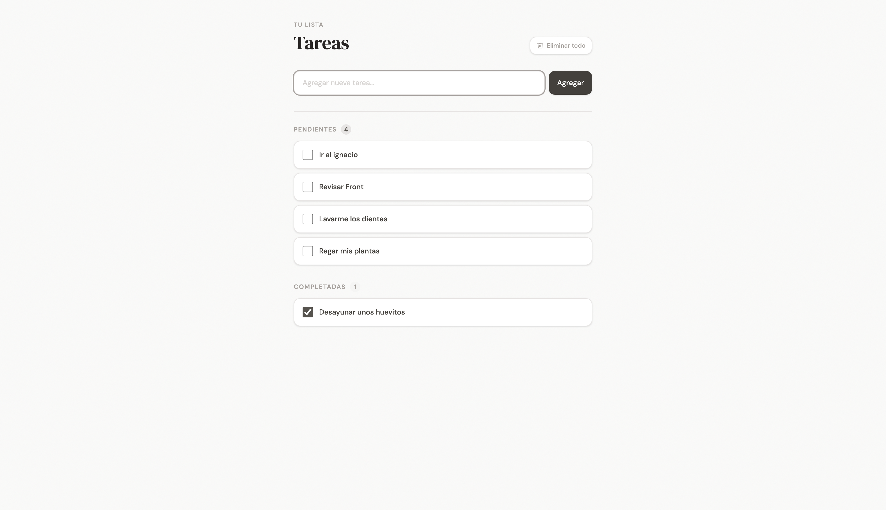

# Task Manager - Frontend

Aplicacion web para la gestion de tareas personales o profesionales.

## Tecnologías Utilizadas

- HTML5
- CSS3 (Tailwind CSS)
- JavaScript

## Clona el repositorio:

```Bash
git clone https://github.com/Naraka28/ToDoList.git
cd TaskApi
```

## Enlace del proyecto

[ToDo App](https://curious-alpaca-db2167.netlify.app/)

## Vista Previa


